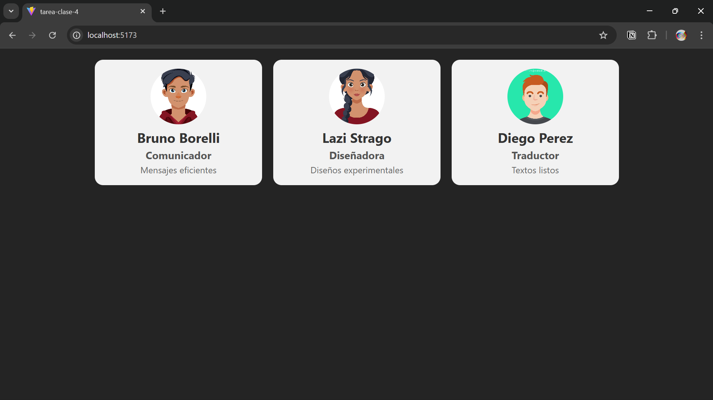

# Mi tarjeta de presentación en React

## Objetivos
Creación de componentes funcionales.

Uso de JSX.

Paso de props para personalizar contenido.

## Desarrollo

### Entorno

Crear un nuevo proyecto con Vite (npm create vite@latest → React → JavaScript).

Borrar archivos que no sean necesarios y dejar limpio el proyecto.

### Componente Tarjeta

Debe recibir por props:

- nombre

- profesión

- imagen (URL de una foto o avatar)

- descripción

El JSX debe incluye:

- Una imagen (\) con alt descriptivo.

- Un título \<h2> con el nombre.

- Un subtítulo \<h3> con la profesión.

- Un párrafo \
 con la descripción.

### Uso del componente

En App.jsx, renderizar al menos 3 tarjetas con diferentes datos, usando el mismo componente.

### Estilo

Un archivo CSS:

- Fondo claro para la tarjeta.

- Bordes redondeados.

- Sombra suave (box-shadow).

- Texto centrado.

---

(https://github.com/Filipc-zak/fs-1-4-bruno-borelli)

--- 

---
